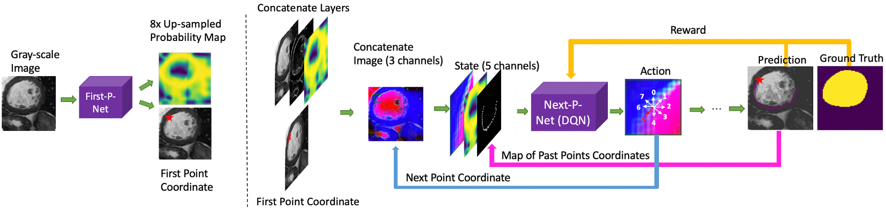
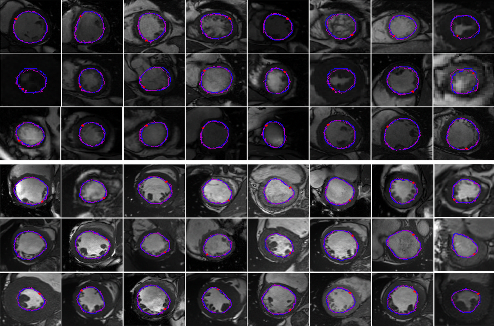

# Left_Ventricle_Segmentation

Edge-Sensitive Left Ventricle Segmentation Using Deep Reinforcement Learning

For the left ventricle segmentation, the clinical experts complete the task of segmentation by first finding an initial point on the boundary, and then locating the rest of the edge points to obtain a closed mask. Inspired by the human segmentation process, we explore how to utilize deep reinforcement learning to perform left ventricle segmentation. 

The following demo shows the segmentation process of the proposed reinforcement learning agent. (This is just a demo to show the process. Actually, the RL agent takes 0.9 seconds in average to find a closed contour). 

<p align="center"></p>

The proposed model consists of two neural networks. The first is FirstP-Net, whose goal is to find the first edge point and generate a probability map of the edge points positions. The second is NextP-Net, which locates the next point based on the previous edge point and image information. This model segments the image by finding the edge points step by step and ultimately obtaining a closed and accurate segmentation result.


- The overall process of the proposed system.
<p align="center"></p>

- Segmentation performances.
<p align="center"></p>


## Dependencies
- CUDA 9.0
- Python 2.7
- PyTorch 0.4.0


The experiments are conducted on a Ubuntu 16.04 LTS PC with one NVIDIA GeForce GTX 1080 Ti. Driver version is 410.78. GCC version is 5.4.0. Please refer to [`requirements.txt`](requirements.txt) for more details about the packages used.


## Installation
1. Clone this repository.
```
git clone git@github.com:Mayy1994/Left_Ventricle_Segmentation.git
```

2. As we use a crop and resize function like that in [Fast R-CNN](https://github.com/longcw/RoIAlign.pytorch) to fix the size of the state, it needs to be built with the right -arch option for CUDA support before training. [[Reference]](https://github.com/multimodallearning/pytorch-mask-rcnn)

    | GPU | arch |
    | --- | --- |
    | TitanX | sm_52 |
    | GTX 960M | sm_50 |
    | GTX 1070 | sm_61 |
    | GTX 1080 (Ti) | sm_61 |

```
cd nms/src/cuda/
nvcc -c -o nms_kernel.cu.o nms_kernel.cu -x cu -Xcompiler -fPIC -arch=[arch]
cd ../../
python build.py
cd ../

cd roialign/roi_align/src/cuda/
nvcc -c -o crop_and_resize_kernel.cu.o crop_and_resize_kernel.cu -x cu -Xcompiler -fPIC -arch=[arch]
cd ../../
python build.py
cd ../../
```
        
## Dataset setup
Please download the datasets [Sunny Brook 2009](https://drive.google.com/file/d/1IoNF54XY7WU51sFqtTUBt9t1xJ8fQaYP/view?usp=sharing) and [ACDC 2017](https://drive.google.com/file/d/1Pu5mYIBI6rEqh0AuJxKbNf_8XmGSfbQm/view?usp=sharing) and unzip the datasets to the current directory.

## Training
- Create a virtual environment and install the required python packages.
- Train First-P-Net and Next-P-Net, respectively.
```
python First_P.py
python train_Sunny_Brook_2009.py    # For SunnyBrook Dataset
python train_ACDC_2017.py           # For ACDC Dataset
```

## Evaluation
- Download the pretrained First-P-Net and Next-P-Net. 

   Put the pretrained First-P-Net models [First-P-Net-SunnyBrook](https://drive.google.com/file/d/1ihYlEgsc8B2JN0s0wNs44V7cqB0aXXJa/view?usp=sharing), [First-P-Net-ACDC](https://drive.google.com/file/d/1xBbaD0TK9L-I3F3ufS909BtAFdb1qkYn/view?usp=sharing) and Next-P-Net models [Next-P-Net-SunnyBrook](https://drive.google.com/file/d/1c64qQ8-nEIUm8cEx35bElzMRpdJ2GW1B/view?usp=sharing), [Next-P-Net-ACDC](https://drive.google.com/file/d/12oR09pA7iiOqVuO4GJCdqjt9YVrB-jMV/view?usp=sharing) under this directory.

- Testing
```
python val_Sunny_Brook_2009.py    # For SunnyBrook Dataset
python val_ACDC_2017.py           # For ACDC Dataset
```


        


